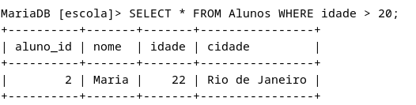

# Projeto Bootcamp DIO - Criação de Banco de Dados do Zero

Este projeto foi desenvolvido como parte do bootcamp na Digital Innovation One (DIO) e tem como objetivo criar um banco de dados do zero. Abaixo, você encontrará informações sobre as consultas SQL realizadas durante o projeto.

## Query Simples

## Expressões para Gerar Atributos Derivados

## Ordenações dos Dados com ORDER BY

## Condições de Filtros aos Grupos - HAVING Statement

## Junções Entre Tabelas para Fornecer uma Perspectiva Mais Complexa dos Dados

Este projeto demonstra a criação de consultas SQL simples e complexas para explorar e analisar dados em um banco de dados. As consultas envolvem expressões SQL avançadas, ordenação de dados, filtros condicionais e junções entre tabelas.

O povoamento dos dados foi realizado com o auxílio de uma IA generativa para tornar o processo mais eficiente e rápido, assim como o desenvolvimento deste readme.